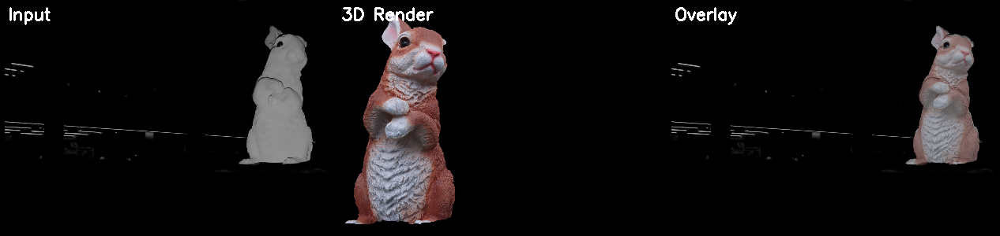
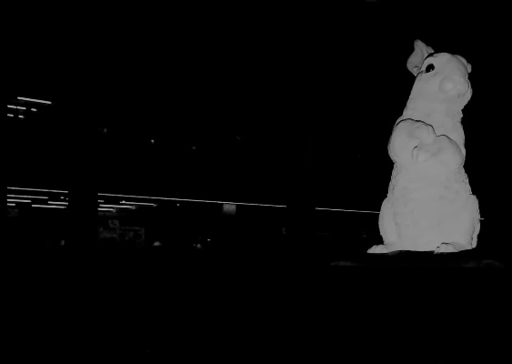
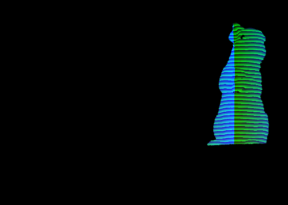
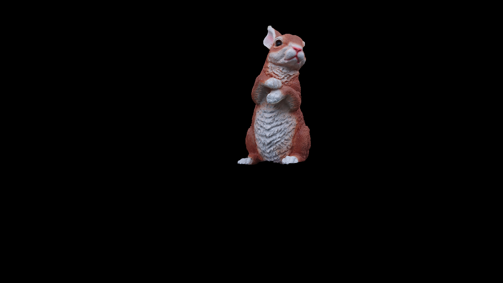
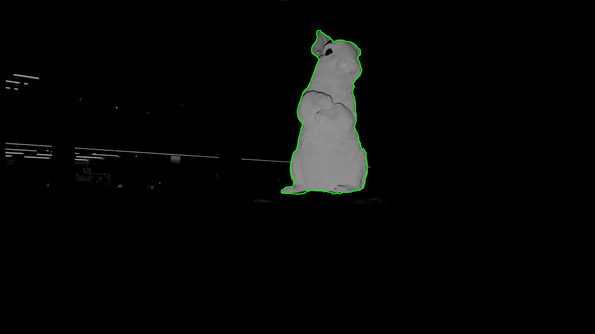
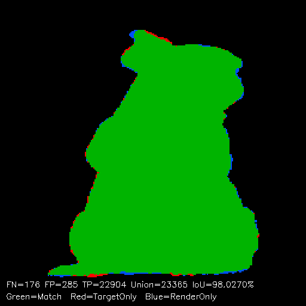
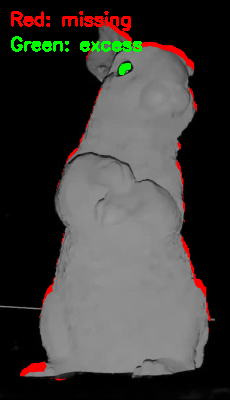

# Silhouette-Based 3D Pose Matching

深度画像のシルエットと3Dモデルのレンダリングを比較し、6DoF姿勢を推定するCPU専用パイプライン。
**GPU不要・事前学習不要・学習データ不要**で、**IoU 98.03%** を達成。

誤差の空間分布を解析する**エラー集中度（Error Concentration Analysis）** により、姿勢推定の品質評価と物体の欠損検出を同時に行う。



---

## 特徴

| 特徴 | 詳細 |
|------|------|
| **GPU不要** | ソフトウェアラスタライザ＋OpenMP並列化。CUDA/OpenGL一切不使用 |
| **事前学習不要** | 3Dモデル（OBJ）と深度画像1枚だけで実行可能 |
| **IoU 98.03%** | 8段階の粗→細グリッドサーチで高精度姿勢推定 |
| **エラー集中度** | Gini係数ベースの誤差空間分布解析。複数のローカルミニマから最適解を自動選択 |
| **欠損検出** | 姿勢推定と同時に、物体の欠損箇所を特定可能 |
| **高速** | C++実装で約30秒（ノートPC、512×512レンダリング） |

---

## 手法概要

### 入力

| 撮影画像（RGB） | 深度画像 |
|:---:|:---:|
|  |  |

深度画像を構造化光カメラで取得し、閾値処理で二値シルエットマスクを生成する。このシルエットと3Dモデルのソフトウェアレンダリング結果をIoU（Intersection over Union）で比較する。

### 疑似深度画像の役割

本手法では深度画像を**二値シルエット（前景/背景）** として利用する。

- **深度画像の利点**: 深度カメラにより前景/背景の分離が閾値処理のみで実現でき、RGB画像で必要なセグメンテーション処理（GrabCut, U-Net等）が不要
- **シルエット化する理由**: 深度値そのものの比較はカメラ距離・角度でスケールが変わるため不安定。シルエット（形状の輪郭）なら照明条件・材質に非依存
- **正規化**: バウンディングボックスでクロップ後、固定サイズにリサイズすることでスケール差を吸収

> **深度値の今後の活用**: 対称性の高い物体では、シルエットだけでは前後の曖昧性（同じ輪郭が表裏両面から生じる）が発生しうる。深度マップ（Zバッファ）同士の比較を追加することで前後判定が可能となり、汎用性が向上する。今回の対象物体は非対称性が十分だったため、シルエットのみで一意に収束した。

### パイプライン全体図

```
深度画像 → 閾値処理 → 二値シルエット → 正規化（256×256）
                                            ↓
                                    ┌── IoU比較 ──┐
                                    ↓              ↓
                              ターゲット     3Dモデルレンダリング
                              シルエット     （ソフトウェアラスタライザ）
                                    ↓
                            8段階グリッドサーチ
                                    ↓
                            最適姿勢パラメータ
                                    ↓
                         テクスチャ付きレンダリング + オーバーレイ出力
```

---

## C++ パイプライン（メイン）

### 8段階最適化

`cpp_pipeline/main.cpp` （約3,300行）に全ロジックを実装。

```
Phase 1  粗い角度探索       ±30° / 5°ステップ（低解像度128×128）
Phase 2  中間角度探索       ±8° / 1°ステップ
Phase 3  カメラ位置最適化    cam_x, cam_y, cam_z の座標降下法
Phase 4  精密角度探索       ±1° / 0.2°ステップ
Phase 5  クリッピング最適化   clip_y + clip_slope_x（傾斜クリップ面）
Phase 5b FOV・距離共同探索   camera_fov と cam_z の2Dスイープ
Phase 6  Edge-guided精密化  cam_z + clip_slope_x + FOV軸の微調整
Phase 7  特徴マッチング      テクスチャベースの特徴点対応で最終補正
```

各フェーズで最良IoUの候補を次フェーズの初期値とし、探索範囲を段階的に狭める。
全探索候補はOpenMPにより並列評価される。

### ソフトウェアラスタライザ

GPUを使わず、三角形メッシュをCPU上でピクセル単位で描画する自前のラスタライザを実装。

- OBJファイルの読み込み（頂点・面・テクスチャ座標・法線）
- 透視投影変換（FOV可変）
- Zバッファによる隠面処理
- バイリニア補間によるテクスチャマッピング
- 傾斜クリップ面（clip_slope_x）対応

### 出力結果

| テクスチャ付きレンダリング | 輪郭オーバーレイ | 50%ブレンド |
|:---:|:---:|:---:|
|  |  |  |

### 最終パラメータ

```
IoU:         98.03%
theta:       92.08°
phi:        -81.77°
roll:        58.63°
cam_x:      -0.524
cam_y:      -0.279
cam_z:       2.491
clip_y:     -0.3725
camera_fov:  40.75°
```

---

## エラー集中度（Error Concentration Analysis）

シルエットのIoUだけでは「姿勢が間違っている」のか「物体に欠損がある」のか区別できない。
本手法では、**誤差ピクセルの空間的偏り**を定量化することで両者を分離する。

### 着想

- **正しい姿勢** → 誤差は欠損箇所に**局所的に集中**
- **間違った姿勢** → 誤差がシルエット全体に**分散**

### 指標

| 指標 | 定義 | 意味 |
|------|------|------|
| **Gini係数** | シルエット重心から12方向セクターの誤差ピクセル数の偏り | 高い = 特定方向に集中 = 欠損由来 |
| **平均境界距離** | ターゲットとレンダーの輪郭間の最近傍点距離の平均 | 低い = 輪郭の整合性が高い = 姿勢が正確 |
| **Combined Score** | `IoU × (1 + α・Gini − β・MeanBoundaryDist)` | IoU・集中度・境界精度の統合評価 |

### 差分マスク（Diff Mask）



**赤**: モデルにない領域（FN） / **緑**: モデルが余分にはみ出た領域（FP）

誤差が耳先端と足元に集中しており、ポーズ自体は正確であることを示している。

### 最終品質スコア

```
IoU:              98.03%
Gini係数:         0.326（誤差が特定方向に集中）
平均境界距離:      0.610px（サブピクセル精度）
P90境界距離:      1.414px
Combined Score:   0.9805
```

---

## 既存手法との比較

| | 本手法 | ICP | DenseFusion | FoundationPose |
|---|---|---|---|---|
| 入力 | 深度→シルエット | 点群 | RGB-D | RGB(-D) |
| GPU | **不要** | 不要 | 必要 | 必要 |
| 事前学習 | **不要** | 不要 | 必要 | 必要 |
| 学習データ | **不要** | 不要 | 数千枚〜 | 数千枚〜 |
| 欠損対応 | **品質スコアで自動判定** | なし | なし | 部分的 |
| 処理時間 | ~30秒 (CPU) | ~1秒 | ~0.1秒 (GPU) | ~0.5秒 (GPU) |

---

## 残り約2%のミスマッチの原因



| 箇所 | 原因 | 改善の難しさ |
|------|------|------------|
| 耳先端 | 実物の耳が薄く柔軟で撮影時にわずかに変形。剛体モデルでは再現不可 | 3Dモデル形状の限界 |
| 足元 | テーブルとの接地面。クリッピング面で近似するが完全一致は不可能 | 接地形状の差 |
| 右側輪郭 | 3Dモデルの体表面と実物の微細な凹凸差（数ピクセル） | スキャン精度の限界 |

---

## Python 補助ツール

C++パイプラインの前処理・分析・可視化に使用したPythonスクリプト群。

| ファイル | 役割 |
|---------|------|
| `estimate_angle_from_depth.py` | 深度画像から初期角度を推定（Phase1の探索範囲決定に使用） |
| `extract_depth_v7.py` | 深度画像の抽出・前処理（ノイズ除去、閾値調整） |
| `preprocess.py` | 入力画像の前処理（リサイズ、正規化） |
| `generate_features_json.py` | 3Dモデルの特徴量をJSON形式で出力 |
| `generate_angle_features.py` | 角度ごとのシルエット特徴量を生成 |
| `analyze_iou.py` | IoUの詳細分析（FN/FP内訳、境界距離） |
| `analyze_diff.py` | 差分マスクの生成・エラー分布の可視化 |
| `compare_depth.py` | 深度画像の比較・アライメント確認 |
| `overlay_color.py` | レンダリング結果のカラーオーバーレイ生成 |
| `render_textured.py` | Pythonでのテクスチャ付きレンダリング（検証用） |
| `viewer3d.html` | Three.jsベースの3Dモデルビューアー |
| `view_result.html` | 結果画像の比較ビューアー |

---

## 苦労した点

### 1. 回転順序の不一致
Three.js（ビューアー）で調整した角度をC++に持ち込んだところ、全く異なる姿勢になった。原因は**回転順序（XYZ vs ZYX）** の不一致。3D回転は非可換なので、順序が変わると結果が全く変わる。全コードをZYX順序に統一して解決。

### 2. 正規化によるカメラ位置の無効化
シルエットをバウンディングボックスで切り出してリサイズ（正規化）する設計のため、カメラの平行移動（cam_x, cam_y）を変えても正規化後のIoUがほぼ変わらない。座標降下法で軸ごとに探索し、clip_y との組み合わせ最適化でようやく改善できた。

### 3. 探索空間の爆発
3軸回転（theta, phi, roll）× カメラ3軸 × clip_y × clip_slope_x × FOV = **9次元の最適化問題**。全探索は不可能なので、深度推定で初期値を絞り込み（±30°以内）、多段階で解像度を上げる戦略を取った。

### 4. 無限ループバグ
`g_tune.*` をforループ条件で使いながらループ内で値を変更し、ループが終了しなくなるバグが発生。ループ前にcenter値を保存して修正。

---

## 今後の課題

- **深度値の活用**: 現在はシルエットのみ使用。対称物体では前後の曖昧性が生じるため、Zバッファ比較で前後判定を行う拡張が有効
- **複数物体への対応**: 異なる形状（対称/非対称）での汎用性検証
- **合成データによる定量評価**: 3Dモデルから疑似深度画像を生成し、Ground Truth付きの大規模評価
- **レンズ歪み補正**: カメラキャリブレーションデータを用いた歪み適用

---
メモ　
pythonで作ってそのうちアプリにするからC++に移行中...

## 実行方法

### 必要環境

- Windows 10/11
- Visual Studio 2022（C++17）
- OpenCV 4.x
- CMake 3.15+

### ビルドと実行

```bash
cd cpp_pipeline
cmake -B build -G "Visual Studio 17 2022" -A x64
cmake --build build --config Release
./build/Release/pose_match.exe
```

入力画像を変更する場合:
```bash
./build/Release/pose_match.exe --input-image path/to/image.png
```

### Python ツールの実行

```bash
pip install opencv-python numpy matplotlib
python python_tools/estimate_angle_from_depth.py
python python_tools/analyze_iou.py
```

---

## プロジェクト構成

```
PoseMatching/
├── cpp_pipeline/
│   ├── main.cpp              # C++ メインパイプライン (~3,300行)
│   ├── CMakeLists.txt         # CMake ビルド設定
│   ├── build_run.ps1          # PowerShell ビルド＆実行スクリプト
│   └── build.bat              # バッチファイル版ビルド
├── models/
│   ├── rabit.obj              # 高ポリゴンモデル (427K faces, 44MB)
│   ├── rabit_low.obj          # 低ポリゴンモデル (60K faces)
│   ├── rabit_low.stl          # STL版（GitHub 3Dビューアー対応）
│   ├── rabit.mtl              # マテリアル定義
│   └── rabit01.jpg            # テクスチャ画像
├── python_tools/
│   ├── estimate_angle_from_depth.py  # 深度→初期角度推定
│   ├── extract_depth_v7.py           # 深度画像前処理
│   ├── preprocess.py                 # 入力画像前処理
│   ├── generate_features_json.py     # 特徴量JSON生成
│   ├── generate_angle_features.py    # 角度特徴量生成
│   ├── analyze_iou.py                # IoU詳細分析
│   ├── analyze_diff.py               # 差分マスク・エラー分布
│   ├── compare_depth.py              # 深度画像比較
│   ├── overlay_color.py              # カラーオーバーレイ
│   ├── render_textured.py            # テクスチャ付きレンダリング
│   ├── viewer3d.html                 # 3Dモデルビューアー
│   └── view_result.html              # 結果比較ビューアー
├── docs/                             # README用画像
├── results/                          # 出力結果
│   ├── rendered_textured.png         # テクスチャ付きレンダリング
│   ├── overlay_contour.png           # 輪郭オーバーレイ
│   ├── overlay_50.png                # 50%ブレンド
│   ├── diff_mask.png                 # 差分マスク
│   └── result.txt                    # 最終パラメータ
├── Image0.png                        # 入力撮影画像
└── Image0_depth.png                  # 入力深度画像
```

---

## 3Dモデルプレビュー

GitHubの3Dビューアーで直接確認できます：
[models/rabit_low.stl](models/rabit_low.stl)

## ライセンス

MIT License
